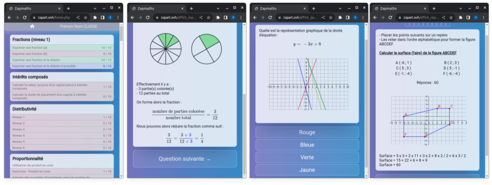

# Zapmaths : Application web d'entraînement des automatismes de calcul

## Présentation

Zapmaths est une application web d'entraînement des automatismes de calcul que j'ai développé durant ma carrière d'enseignant durant le confinement.

Une version est actuellement disponible à l'adresse suivante :

https://zapart.ovh

Vous pouvez vous identifier avec :

- login     : demo01/demo02/.../demo99
- password  : demo01/demo02/.../demo99

