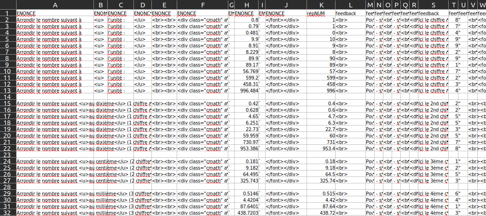

# Zapmaths: Web application for practicing calculation skills

## Presentation

Zapmaths is a web application I created during my teaching career, designed for both classroom and home use. The application generates questions, corrections, graphics, diagrams, and schemas using random values. This allows students to practice at their own pace, while I can monitor their progress and activities.

I started it during the lockdown, relying on old memories and sames tutorials when I used to create websites in PHP/MySQL back in the 2000s. The code is not clean at all, and the database management is quite messy. Nevertheless, it remains functional. I wanted to make it available as soon as possible, so I didn't take the time to learn how to do it properly.

    

### Demo
A version is presently accessible at [https://zapart.ovh](https://zapart.ovh)

You can log in with:

- login : demo01/demo02/.../demo99
- password  : demo02/demo02/.../demo99

### Editing questions on EXCEL

* generating semi-random values on EXCEL
* usage of Mathjax.js to display mathematical formulas
  

### Converting EXCEL to CSV with python

* PIL & matplotlib.pyplot to generate graphs, diagrams and images according to the values of the questions

### Web app

* Minimal html/css/php/msql with phpMyAdmin
