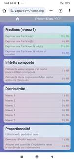

# --- Work in progress editing Readme ---

# Zapmaths: Web application for arithmetic akills practice

## Presentation

Zapmaths is a web application for practicing arithmetic skills that I developed during my teaching career. It is used both in the classroom and at home. The numerical values of the questions are random and are automatically corrected. Students can practice at their own pace, and teachers can track their students' progress and help them target their difficulties.

I started it during the lockdown, relying on old memories when I used to create websites in PHP/MySQL back in the 2000s. The code is not clean at all, and the database management is quite messy. Nevertheless, it remains functional.

Excel (question writing) --> Python (xls_to_csv_questions_generator.py) --> MySQL (phpMyAdmin) <--> PHP/HTML/CSS (LAMP Stack)

A version is currently available at the following address:

['https://zapart.ovh'](https://zapart.ovh)

You can log in with:

- login     : demo01/demo02/.../demo99
- password  : demo01/demo02/.../demo99

## === to write : ===

## Editing questions on EXCEL

* generating semi-random values on EXCEL

* usage of Mathjax.js to display mathematical formulas

## Converting EXCEL to CSV with python

* usage of matplotlib.pyplot to generate graphs according to the values of the questions

* usage of base64 to encode images, specials questions, etc

## Web app

* minimal html/css/php/msql with phpMyAdmin

* SQL supervision

## Access to a collected and anonymized real data sample

* just an idea